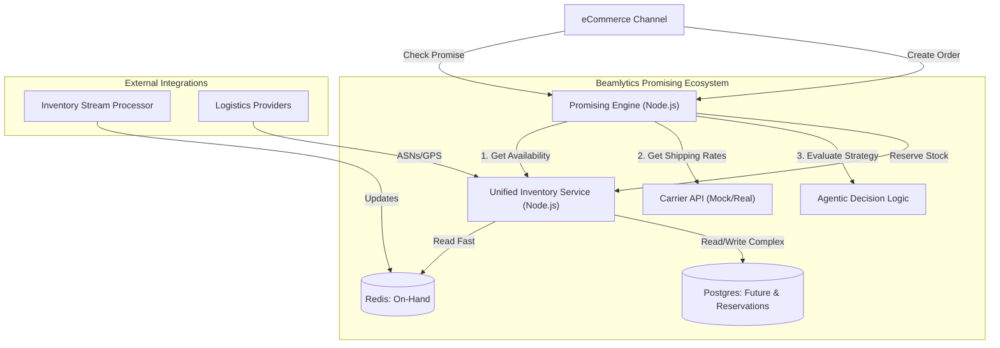

# Beamlytics Promising Engine & Unified Inventory

## 1. Business Use Case
In modern e-commerce, customer satisfaction hinges on accurate delivery promises. Traditional systems only promise against **On-Hand** inventory (what is physically in the warehouse). This leads to:
*   **Lost Sales**: Items are "Out of Stock" even though a replenishment truck is arriving tomorrow.
*   **Inefficient Sourcing**: Orders are split unnecessarily or shipped from distant locations, eroding margins.

**The Solution**: A **Future-Aware Promising System**.
This system enables promising against **Future Inventory** (Inbound Purchase Orders and ASNs). If a customer orders an item that is out of stock but arriving on a truck in 2 days, we promise delivery in `2 Days + Transit Time`, capturing the sale securely.

## 2. Solution Overview
The solution consists of three core components working in harmony:

1.  **Beamlytics Promising Engine (The Brain)**:
    *   Intelligent Sourcing Logic.
    *   Agentic AI (`PromisingAgent`) to negotiate trade-offs (Speed vs. Cost vs. Retention).
    *   Real-time evaluation of sourcing candidates.

2.  **Unified Inventory Service (The Source of Truth)**:
    *   **Hybrid Data Model**:
        *   **Redis**: Lightning-fast On-Hand inventory reads.
        *   **Postgres**: Complex management of Future Inventory (ASNs, POs) and Reservations.
    *   **Reservation System**: Prevents overselling via Hard/Soft locks.

3.  **Sidereal Observatory (The Control Tower)** (External):
    *   Visualizes the supply chain network, inventory positions, and promising decisions.

## 3. Architecture



## 4. Services & Connections

| Service | Port | Description | Dependencies |
| :--- | :--- | :--- | :--- |
| **Promising Engine** | `4000` | Sourcing & Logic API | `Unified Inventory Service` |
| **Unified Inventory** | `3000` | Inventory State & Reservations | `Redis`, `Postgres`, `Kafka` |
| **Redis** | `6379` | Cache for On-Hand Totals | - |
| **Postgres** | `5432` | DB for ASNs & Reservations | - |

## 5. Deployment & Configuration

### Prerequisites
*   Docker & Docker Compose
*   Node.js v18+ (for local dev)

### Bootstrapping the Full Stack
We use `docker-compose` to run the entire ecosystem locally.

1.  **Navigate to the project root**:
    ```bash
    cd ~/mygithubprojects/beamlytics-promising-engine
    ```

2.  **Start Services**:
    ```bash
    docker-compose up --build
    ```
    *This starts Redis, Postgres, Kafka, Unified Inventory Service, and the Promising Engine.*

3.  **Environment Variables**:
    *   **Promising Engine**: Check `.env` or `docker-compose.yml`. Key var: `INVENTORY_SERVICE_URL`.
    *   **Unified Inventory**: Key vars: `REDIS_URL`, `DATABASE_URL`.

## 6. Testing Guide

### A. Running Unit Tests (Individual Services)

To run unit tests for the **Promising Engine**:
```bash
# In beamlytics-promising-engine/
npm install
npm test
```
*   *Validates: Agent Logic, Sourcing Math, Future Date Calculations.*

To run unit tests for the **Unified Inventory Service**:
```bash
# In unified-inventory-service/
npm install
npm test
```
*   *Validates: Redis/DB Aggregation, Reservation Locking.*

### B. Running End-to-End (E2E) Tests

Once the Docker Stack is running (step 5), you can run the sanity suite to verify the services are talking to each other.

1.  **Install Test Dependencies**:
    ```bash
    npm install axios --save-dev
    ```

2.  **Run E2E Sanity Check**:
    ```bash
    npx jest tests/e2e/sanity.test.ts
    ```
    *   *Checks: Service Health, Basic Promise Request Flow.*

## 7. Operational Details

*   **Logs**: Access logs via `docker-compose logs -f promising-engine`.
*   **Scaling**: The Promising Engine is stateless and can be horizontally scaled behind a load balancer. Unified Inventory Service relies on Postgres for locking, ensuring consistency even with multiple replicas.
