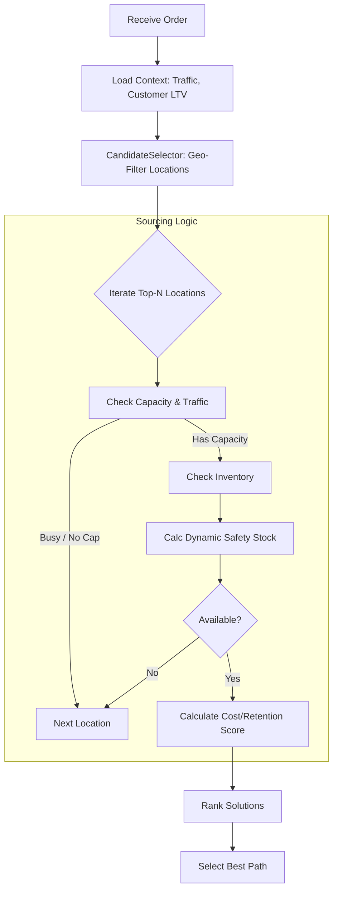

# Beamlytics Promising Engine

## Overview
The **Beamlytics Promising Engine** is a high-performance, intelligent sourcing solution designed to optimize order fulfillment. It goes beyond simple inventory checking by incorporating real-time business context—such as store traffic, customer long-term value (LTV), and variable preparation times—to make smarter promising decisions.

## Business Use Case
In modern commerce, "available" inventory doesn't always mean "profitable" fulfillment.
*   **Problem**: Fulfilling online orders from a store during peak hours disrupts walk-in customers.
*   **Problem**: Rejecting a high-value VIP customer's order due to low margin can lead to churn.
*   **Solution**: This engine allows businesses to:
    *   Protect in-store operations during busy windows.
    *   Prioritize "Saving the Sale" for VIP customers over immediate transport costs.
    *   Dynamically adjust promise dates based on real-time item manufacturing/prep times.

## Solution Aspects

### 1. Dynamic Safety Stock
The engine automatically adjusts safety stock buffers based on real-time store traffic. High foot traffic triggers higher safety buffers to ensure shelf availability for walk-in shoppers.

### 2. Pluggable Architecture
Designed for flexibility, the system relies on interfaces for key external services:
*   `InventoryProvider`: Switch between mock, real-time API, or stream-based inventory.
*   `RateShopper`: easy integration with carriers like FedEx, UPS, or internal fleet logic.

### 3. Configurable Optimization Strategies
Business logic is not hard-coded. The `SourcingConfig` allows switching strategies:
*   **PROFIT**: Minimizes shipping + split costs.
*   **RETENTION**: Maximizes fill rate for high-LTV customers, even at higher cost.
*   **BALANCED**: A weighted approach.

### 4. Dynamic SLAs
Promise dates are calculated dynamically per item. If an item requires 4 hours of "prep time" (e.g., custom embroidery, fresh food prep), the SLA is adjusted automatically.

### 5. High-Performance Geo-Filtering (V3)
To handle thousands of locations, a `CandidateSelector` pre-filters nodes using spatial efficiency (Geo-Radius/Zone) before executing expensive logic, ensuring low latency scaling.

## High-Level Architecture

The following diagram illustrates the decision flow for sourcing an order:

## Generated By
> [!NOTE]
> Everything in this repository, including code, documentation, and design, is generated using **Gemini Pro 3** and **Antigravity**.

## Context
*   **Conversation**: "Enhancing Promising Engine"
*   **Documentation**: See the `docs/` folder for detailed implementation plans, backlogs, and walkthroughs.
