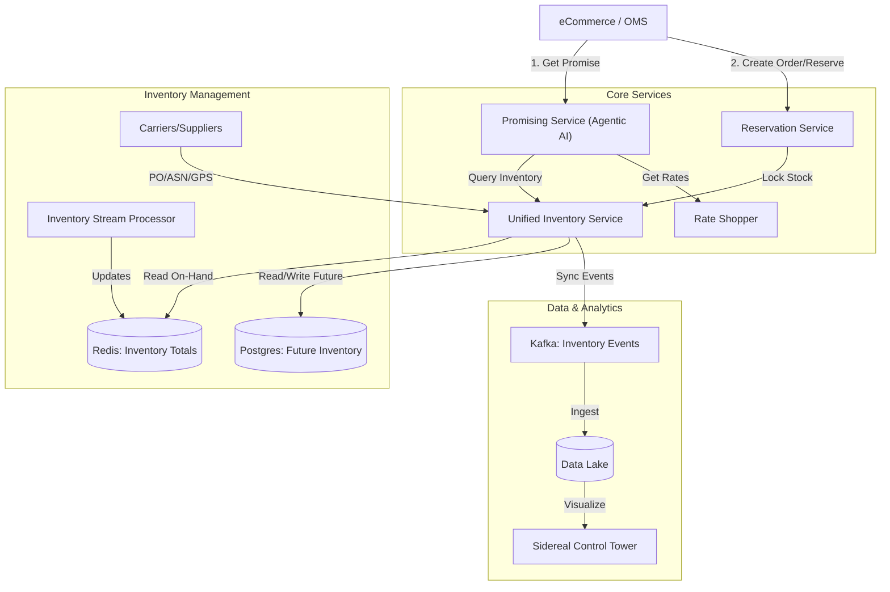

# Comprehensive Promising & Inventory Architecture

## Executive Summary
This document outlines the re-architecture to create a robust Supply Chain Promising System. It integrates `beamlytics-promising-engine` (Logic), a new **Unified Inventory Service** (State), and `sidereal-observatory` (Visualization). The solution focuses on supporting Future Inventory (ASNs), Reservation Management, and Agentic AI-driven decision making.

## System Architecture

## 1. Unified Inventory Service (UIS)
**Role**: The Source of Truth for "What do we have?" and "What is coming?".
**Tech Stack**: Node.js (Express) + Redis (On-Hand) + Postgres (Future).

### Key Features
*   **On-Hand Inventory**: Reads efficient running totals from `inventory-stream-processor`'s Redis (`inventory:totals`).
*   **Future Inventory System**:
    *   Tracks Lifecycle: `PO_CREATED` -> `ASN_CREATED` -> `IN_TRANSIT` (GPS Updates) -> `RECEIVED`.
    *   API: `GET /inventory/future?sku=XYZ&window=7days`.
*   **Reservation Management**:
    *   Manages Soft Locks (`RESERVED`, `ALLOCATED`, `SHIPPED`, `CANCELLED`).
    *   Availability Logic: `Available = OnHand + Future(Ready) - SafetyStock - Reservations`.

### Data Flow for Control Tower
All state changes (PO updates, Truck GPS, Reservations) emit events to Kafka topics `inventory.lifecycle` and `logistics.tracking`. These are consumed into BigQuery for `sidereal-observatory`.

## 2. Reservation & Allocation Service
**Role**: Designates inventory to specific orders to prevent overselling.
**Tech Stack**: Part of UIS or Microservice (Node.js).

### State Machine
1.  **Soft Reserve**: Order created. Stock decremented temporarily. TTL (e.g., 15 mins).
2.  **Hard Allocate**: Order Payment Confirmed & Sourced. Stock permentantly decremented. Linked to specific Node/ASN.
3.  **Shipped**: Inventory physically leaves. Reservation removed, Stock count updated by Stream Processor.
4.  **Cancelled**: Revert Reservation/Allocation.

## 3. Enhanced Promising Engine
**Role**: The Brain. Decides *how* to fulfill an order.
**Current Base**: `beamlytics-promising-engine`.

### Enhancements
1.  **Future Inventory Support**:
    *   Extend `SourcingEngine` to interpret `DIRECT_INBOUND` strategies.
    *   Logic: If `OnHand < OrderQty`, check `UIS.getFutureInventory()`. If `ASN.eta <= PromiseDate`, promise against it.
2.  **Safety Stock Rules**:
    *   Integrate dynamic rules (e.g., "Keep 10 units for Walk-in") into availability checks.
3.  **Agentic AI Integration**:
    *   Replace rigid "Single vs Split" logic with a **LangGraph Agent**.
    *   **Agent Workflow**:
        *   Step 1: Gather Context (Customer Loyalty, Margin, SLAs).
        *   Step 2: Query UIS (OnHand + Future).
        *   Step 3: Evaluate Options (Ship from Store A vs Cross-dock from ASN B).
        *   Step 4: Optimize (Profit vs Speed).

## Implementation Roadmap

### Phase 1: Unified Inventory Service (The Foundation)
1.  Create `unified-inventory-service` repo (or module).
2.  Implement `RedisAdapter` (Read `inventory-stream-processor`).
3.  Implement `FutureInventory` DB Schema (POs, ASNs, Trucks).
4.  Expose API: `POST /inventory/query`.

### Phase 2: Promising Engine Agent (The Brain)
1.  Refactor `beamlytics-promising-engine`.
2.  Integrate `InventoryProvider` to call UIS.
3.  Implement `PromisingAgent` (LangGraph) to handle complex logic.

### Phase 3: Control Tower Sync (The Visibility)
1.  Configure Kafka Producers in UIS.
2.  Setup BigQuery Sink.
3.  Update `sidereal-observatory` to visualize "Inbound Trucks" and "Future Stock".

## Next Steps
*   [ ] User Approval of Architecture.
*   [ ] Setup `unified-inventory-service` Node.js project.
*   [ ] Define Postgres Schema for Future Inventory.
