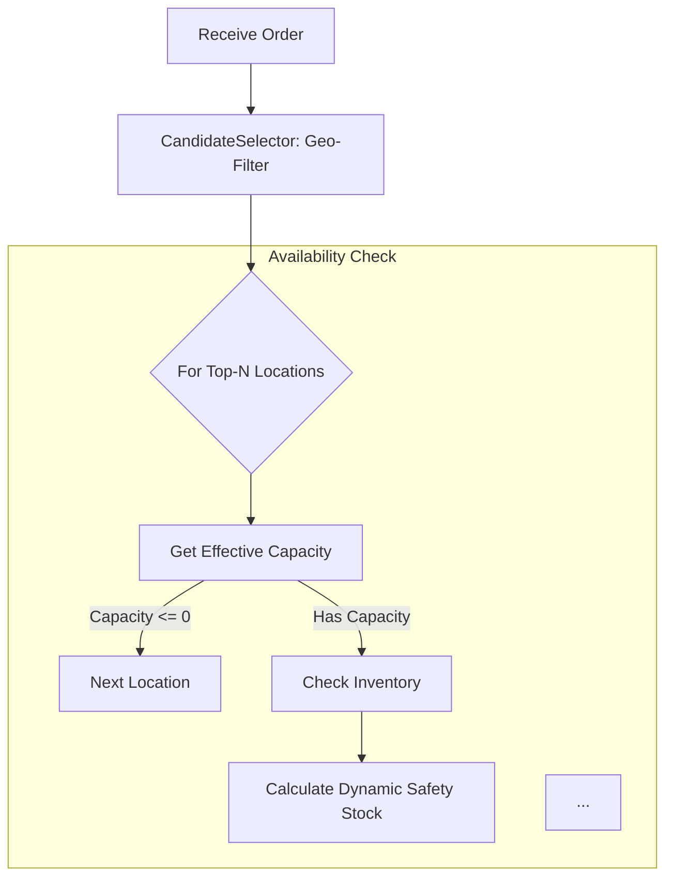

# Commerce Promising Engine Walkthrough

I have implemented the Promising Engine with the following capabilities:

### V3 Performance
1.  **Candidate Selection**: An O(N) -> O(k) `CandidateSelector` that filters locations by geo-radius or zone before heavy processing. 
    - Configuration: `SourcingConfig.maxSearchRadiusMiles`.

### V2 Enhancements
1.  **Dynamic Safety Stock**: `CapacityService` now increases safety stock buffers during "busy" high-traffic periods (simulated).
2.  **Pluggable Interfaces**: `InventoryProvider` and `RateShopper` interfaces allow switching between real/mock/stream services.
3.  **Configurable Logic**: `SourcingConfig` allows choosing between `PROFIT`, `RETENTION`, or `BALANCED` strategies.
4.  **Dynamic SLA**: Supports item-level `prepTimeHours` (e.g., custom manufacturing time) which updates the promise date.

### Decision Logic Flow


### Verification Results

I ran a suite of Jest unit tests covering key scenarios.

### Test Output (V3)
```
 PASS  src/sourcing/engine.test.ts
  SourcingEngine V3 (Performance)
    ✓ should Exclude far location based on Radius Filter (7 ms)
    ✓ should Include far location if Radius is Large (3 ms)
```

## How to Run
1.  **Run Tests**:
    ```bash
    npm test
    ```
2.  **Start Server**:
    ```bash
    npm start
    ```
